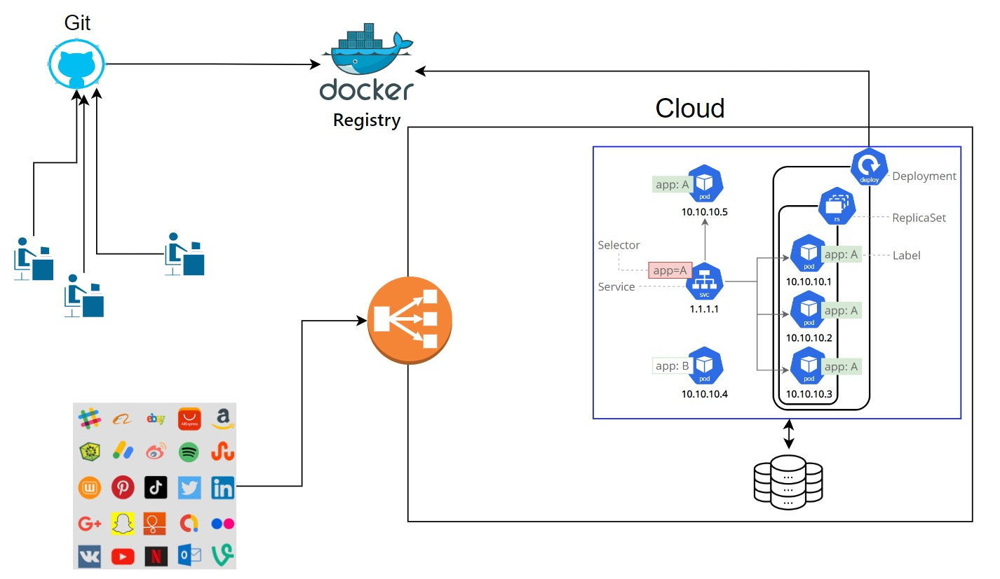

# Cloud local com Kind

## Objetivo
Este repositório tem como o objetivo o estudo da ferramenta Kind, ferramenta que executa clusters kubernetes localmente usando container docker "nodes".  
[Documentação do Kind](https://kind.sigs.k8s.io/)

## Arquitetura da aplicação 


Baseado na arquitetura, o nosso foco é replicar um fluxo de deployment para o cluster na cloud, usando o kind podemos representar na nossa máquina local um ambiente cloud, e com o kubernetes montamos nosso kluster.
Apartir de um microserviço desenvolvido pelo nosso amigo Madson Silva, criamos os nossos arquivos dockerfile, docker compose e deplyment para gerenciar a imagem do nosso micro serviço e assim disponibilizar uma imagem para o nosso docker hub e com o deployment.yaml fazer o download dessa imagem e gerar nossos pods e services no ambiente kubernetes.

### Ferramentas necessárias para subir o ambiente
- docker e docker compose
- kind
- kubernetes
- java 21 
- docker hub

### Observações da ativiade
- ⚠️ o java usamos o integrado do intellij, assim temos mais versatilidade e não precisamos ficar instalando o java diretamente no computador. O importante é você ter disponível o **java na versão 21** .
- Para gerar os **persistences volumes** de forma mais fácil precisamos utilizar um scrip disponível em um repositório [github](https://github.com/rancher/local-path-provisioner) public e confiável. segue o código ``` kubectl apply -f https://raw.githubusercontent.com/rancher/local-path-provisioner/v0.0.28/deploy/local-path-storage.yaml```  

## tecnologias utilizadas no projeto
- [Spring Boot](https://spring.io/projects/spring-boot)
- [JPA](https://medium.com/@duduxss3/entenda-de-uma-vez-por-todas-jpa-e-hibernate-e2a1237161a9)
- [H2](https://www.h2database.com/html/tutorial.html)
- [API REST](https://www.redhat.com/pt-br/topics/api/what-is-a-rest-api)
- [docker compose](https://docs.docker.com/compose/install/) / [docker hub](https://hub.docker.com/)
- [kubernetes](https://kubernetes.io/pt-br/docs/home/)
- [open lens](https://k8slens.dev/)
- [kind](https://kind.sigs.k8s.io/)

## Minha opinião como desenvolvedor
Fui muito interessante participar dessa párica com o Madson Silva e os demais membros, com isso pude aprender um pouco mais sobre o fluxo real que ocorre quando os projetos em que participamos no dia a dia de trabalho percorrem. 
Sinto que preciso me aperfeiçoar mais para fixar melhor todos os conceitos deste universo de devpos. Meu obejetivo não é me tornar um especialista, apenas ter uma boa idea de como as coisas funcionam a ponto de saber explicar para os demais.

## Parceria Madson Silva - youtube  
Madson é um desenvolvedor backend Senior com um vasto conhecimento em java, spring boot, kubernets e muitas outras tecnologias pertencentes ao universon do backend.

Atualmente trabalha e mora exterior, portugal, e compartilhar sua experiência com os membros do canal sendo um transformador na vida de muitos membros que hoje já trabalham na área.

[canal no youtube do Madson Silva](https://youtu.be/dHWDN1TSTi8)
